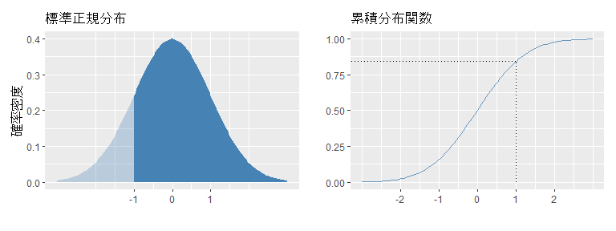
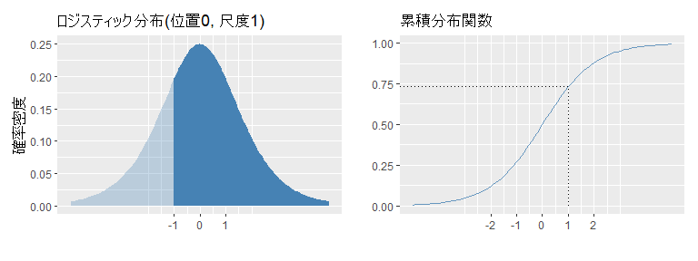
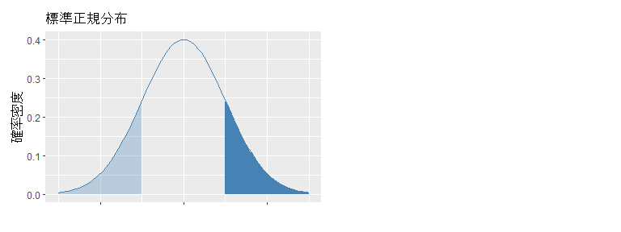
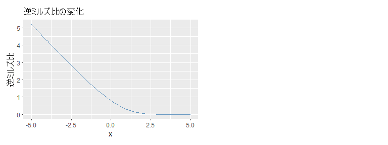

# 2値変数の分析

## プロビット・モデル

プロビット・モデルは、従属変数の値が1か0しかないときに使用されるモデルの1つ。従属変数の値が1か0しかないというのは、たとえば、ある個人$i$が有配偶者かどうかを表す変数を$z_i$とし、有配偶者であれば$z_i=1$、そうでなければ$z_i=0$とするような場合である。分析の目的は、さまざまな独立変数によって個人$i$が有配偶者である（すなわち、$z_i=1$となる）確率を予測するモデルを推定すること、である。

これらのモデルでは、実際に観測される$z_i$の値は1か0しかあり得ないが、その背後に$-\infty$から$+\infty$までの連続的な値をとる$z^\*\_i$があり、$z^\*\_{i} > 0$ならば$z\_i=1$、$z^\*\_i \leq 0$ならば$z\_i=0$となる、と想定する。現実には各個人は「有配偶者である」か「有配偶者でない」のどちらかでしかないが、潜在的に各個人が「有配偶者でありやすさ」のようなものを持っていて、ある個人の「有配偶者でありやすさ」が一定の閾値を超えたところでその個人は有配偶者になる、と考えるわけである。そして、この$z^\*\_i$を従属変数とする線形回帰モデルを考える。独立変数を$w$、誤差項を$e$とすると：

$$
z^*_i = \alpha w_i + e_i
$$

たとえば$w$が年収で、$\alpha$が正の値であったとすれば、それは「年収が高いほど『有配偶者でありやすさ』が高くなる」ということである。ところで、われわれの目的は$z_i=1$となる確率を求めることである。$z^\*\_i >0$ならば$z\_i=1$ということを思い出せば、この目的は達成できる。上式より、$z^\*\_i >0$は$\alpha w\_i + e\_i >0$と等しく、後者は$e\_i > -\alpha w\_i$と書き換えられる。よって、$z\_i=1$となる確率を${\rm Pr}(z\_i=1)$と表せば、

$$
{\rm Pr}(z_i=1) = {\rm Pr}(z^*_i >0) = {\rm Pr}(e_i > -\alpha w_i)
$$

というわけで、結局は$e\_i > -\alpha w\_i$となる確率が分かればよい、ということである。プロビット・モデルでは、$e\_i$は標準正規分布にしたがうことが仮定される。いま、$\alpha w\_i = 1$であるとすると、$e\_i > -\alpha w\_i$になる確率は、視覚的には下左図の濃い青のエリアの面積で表せる。正規分布の左右対称性から、この部分の面積は$-\infty \leq x \leq 1$における累積確率密度に等しいので、下図右より0.8413447である。

<!-- -->

結局、プロビット・モデルにおいて、$z\_i=1$となる確率は$\Phi(\alpha w\_i)$なので（$\Phi$は累積分布関数を表す）、

$$
{\rm Pr}(z_i=1) = \Phi(\alpha w_i)
$$

である。実際のデータに含まれる$z$と$w$から$\alpha$の値を推定するのが、プロビット・モデルである。

## ロジット・モデル

社会学でよく使われるロジット・モデルは、$e\_i$の分布について標準正規分布ではなくロジスティック分布を仮定している点が違うだけで、「まず連続的な潜在変数を予測する線形回帰モデルを考え、$\alpha w\_i$を適当に変換することで${\rm Pr}(z\_i=1)$を予測する式を立てる」という基本的な考え方は同じである。ロジスティック分布とその累積分布を図示すれば、プロビット・モデルと類似したことを考えているのが分かるだろう。

ただし、ロジット・モデルにおける誤差項の分布の尺度は、プロビット・モデルにおける誤差項の分散（$\sigma^2=1$）のようにアプリオリに決まってはいない。それが複数のロジット・モデル間でパラメータの推定値を比較することを難しくしているので、分析結果の解釈には慎重でありたい（cf. Breen et al. 2018）。

<!-- -->

## Reference

- Breen, Richard, Kristian Bernt Karlson, and Anders Holm, 2018, "Interpreting and Understanding Logits, Probits, and Other Nonlinear Probability Models," *Annual Review of Sociology*, 44: 39-54.

## Advanced：逆ミルズ比とは

プロビット・モデルに付随してしばしば出てくる「逆ミルズ比」について簡単に説明する。逆ミルズ比とは、$e\_i > -\alpha w\_i$（つまり$z\_i = 1$）という条件のもとでの誤差項$e\_i$の期待値である。それがなぜ「比」なのかは式を変形すれば明らかになるので、一歩ずつ考えてみよう。条件付き確率の定義より、

$$
{\rm E}(e_i|e_i > -\alpha w_i) =
\frac{ {\rm E}(e_i, e_i > -\alpha w_i) }{ {\rm Pr}(e_i > -\alpha w_i) }
$$

正規分布の左右対称性より、分母は${\rm Pr}(e\_i > -\alpha w\_i) = \Phi(\alpha w\_i)$。分子は下図の右側の領域について期待値を求めることに等しいから（ヒント：${\rm E}(e\_i, -\infty \leq e\_i \leq +\infty) = \int_{-\infty}^{+\infty}e\_i\phi(e\_i) = 0$）、

$$
\frac{ {\rm E}(e_i, e_i > -\alpha w_i) }{ {\rm Pr}(e_i > -\alpha w_i) } =
\frac{\int_{\alpha w_i}^{+\infty}e_i\phi(e_i)}{\Phi(\alpha w_i)}
$$

<!-- -->

正規分布において$x\phi(x) = -\phi'(x)$なので、

$$
\frac{\int_{\alpha w\_i}^{+\infty}e\_i\phi(e\_i)}{\Phi(\alpha w\_i)} =
\frac{-\int_{\alpha w\_i}^{+\infty}\phi'(e\_i)}{\Phi(\alpha w\_i)}
$$

$\int_{\alpha w\_i}^{+\infty}\phi'(e\_i) = \phi(+\infty) - \phi(\alpha w\_i)$なので、

$$
\frac{-\int_{\alpha w_i}^{+\infty}\phi'(e_i)}{\Phi(\alpha w_i)} =
\frac{-(\phi(+\infty)-\phi(\alpha w_i))}{\Phi(\alpha w_i)} =
\frac{\phi(\alpha w_i)}{\Phi(\alpha w_i)}
$$

$x$の値の変化による逆ミルズ比$\frac{\phi(x)}{\Phi(x)}$の変化を図示すると、下図のとおりで、逆ミルズ比は$x$の単調減少関数である。$x = \alpha w\_i$と考えれば、$z\_i =1$になる確率が高い個人$i$ほど逆ミルズ比は小さいということになる。「有配偶者でありやすさ」の例に戻れば、「有配偶者でありやすい」個人ほど逆ミルズ比が小さく、「有配偶者でありにくい」個人ほど逆ミルズ比が大きい。

<!-- -->
