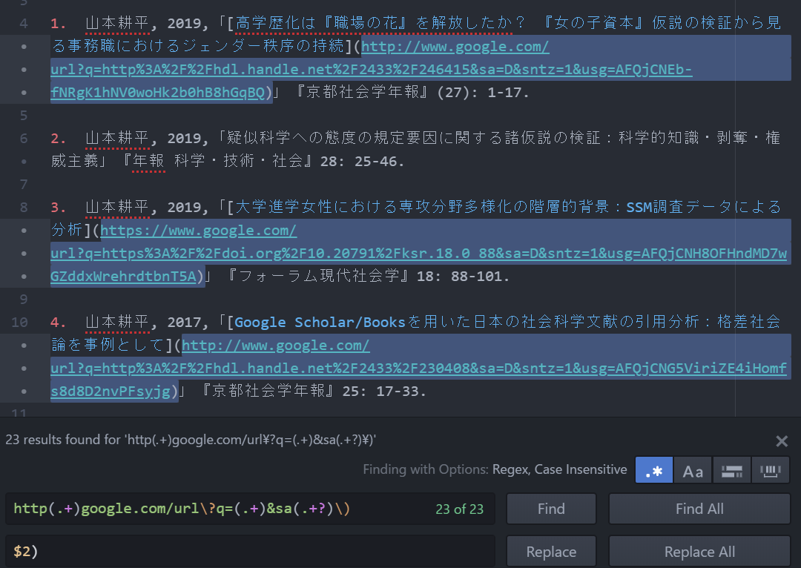

<style>
img{
	display: block;
	width: 350px;
  margin: auto;
}
</style>

# Google Sitesからお引越し

Google Sitesで作っていたウェブサイトをこちらに移行するにあたって、せっかくなら既存のページもMarkdownファイルにしてアップしたいな～、と考えました。その作業の個人的記録です。

## HTMLファイルをMDファイルに変換

[Turndown](https://github.com/domchristie/turndown){:target="_blank"}をはじめいくつか手段があると思いますが、サイトをブラウズしながら必要なページを見繕って随時ぽちぽち変換できるとラクそうなので、Firefoxに拡張機能[MarkDownload](https://github.com/deathau/markdownload){:target="_blank"}を入れてみました。

## リンクの貼り替え

Google Sitesは外部サイトへのリンクにリダイレクトページを噛ませる仕様になっているので、MDファイルに変換しただけではそれが残っています。テキストエディタで削除しましょう。

リンク先のURLが`https://www.google.com/url?q=`と`&sa`から始まり`)`で終わる文字列によって囲まれているので、正規表現を使って一括置換……と思いきや、仕様がどこかの時点で変わったのかhttpとhttpsが混在している…。というわけで、これで検索して、

```
http(.+)google.com/url\?q=(.+)&sa(.+?)\)
```

`$2`だけ残すとURLの閉じ括弧が消えてしまうので、`$2)`で置換。



スラッシュとかのエンコードはよしなにアレして、改行も`^\n`で検索して消してやればきれいに整います。

あと、これも仕様でリンクのtarget属性がデフォルトのままなので、別タブにしておきました。

## ついでに、画像にまつわるエトセトラ

節タイトルでピンときたあなたは同世代。

上の画像は手抜きのスクショなので画質が悪く、ブラウザしだいで拡大表示されるとちょっと困ります。そこで、画像のサイズを指定する方法を少しぐぐってみると、``タグを使うしかない、という趣旨の記事をいくつか見かけました。

…が、1つの文書内で決まったサイズで揃えられればよいのであれば、ファイルの冒頭とかに`<style>`を置いておくほうが速いですね。Rmarkdownで最初のチャンクに`opts_chunk$set`を書いて設定しておくのと似たイメージ。

……と思ってclassのスタイルを定義してみたのだけれど、文書全体を`<div>`で囲んでしまうとその中身もHTMLで書かないといけなくなるのですね。あまりいろいろやると、テンプレートのスタイルを上書きしてしまう事案が発生しそうですが、とりあえず。

```html
<style>
img{
	display: block;
	width: 350px;
	margin: auto;
}
</style>
```
