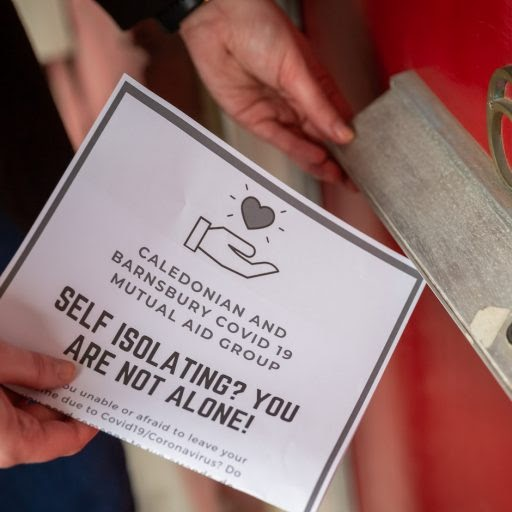
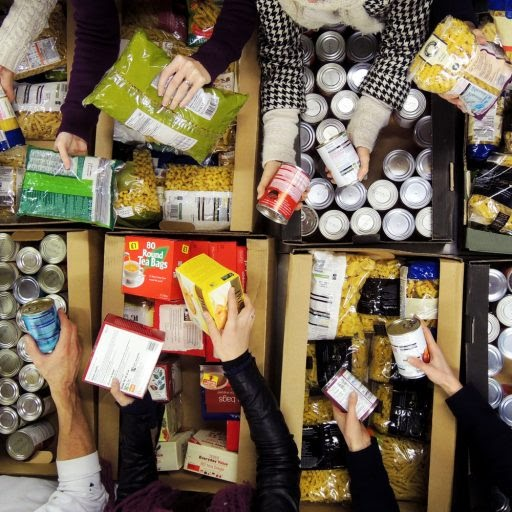

# 【勝手に翻訳】コロナパンデミックのもとで他者を助ける10の方法

- Title: コロナパンデミックのもとで他者を助ける10の方法（10 Ways to Help Others during the Coronavirus Outbreak）
- Author: Lucy Purdy
- Date: Mar 20th 2020（[Positive.News](https://www.positive.news/society/10-ways-to-help-others-during-the-coronavirus-outbreak/){:target="_blank"}）

スーパーで買い占めをしたりトイレットペーパーを奪い合ったりしている人びとの姿を見ると、人間って嫌な生き物だなという気がしてしまいますね。でも、そういう人目をひくニュースの裏では、もっとたくさんの人が、手と手を取り合って助け合いたいと思っているのです。ソーシャル・ディスタンスが求められる今、それでも私たちの連帯を強めるための10の方法を見てみましょう。

## 1. みんなで士気を高めよう：相互扶助グループに入ってみる

イギリスでは900以上の相互扶助グループが立ち上がり（今も増加中）、たくさんのボランティアが参加しています。生活に必要な物資を届けることから、気軽な電話を1本入れることまで、彼らの活動はさまざま。コロナウイルスが社会に多大な影響を与えることが明らかになってから、ボランティアの数は急増しています。

この種のグループは、すでにイギリス中で始まっています。たとえば、スコットランドのハイランド地方で活動しているKinlossや、コーンウォールのLannerなど。自分の地元で活動しているグループを探して、自分にできることがないか聞いてみましょう。

そういう活動の目的は何かって？ この危機的状況でもっともダメージが大きい人たちを助けることです。たとえば、高齢だったり、もともと家族がいなかったり、障がいや病気があったり、そんな理由で孤立状態に陥っている人。相互扶助グループのネットワークを作っているAnna Vickerstaffが言うように、「ひとりで苦む人がいないようにしたい、ただそれだけ」ということです。

地元にそんなグループがない？ じゃあ、作ってみたらどうでしょう。相互扶助グループを始めるためのヒントをいろいろ紹介している[Covid-19 Mutual Aid](https://covidmutualaid.org/){:target="_blank"}によれば、こういう活動はむしろ少人数のグループでやったほうが良いそうです。それでも、自分が住んでいる通りの人たちを助けることはできます[^1]。

## 2. 将来への投資：経営に苦しむ地元のお店からクーポンを買おう

人びとの密集を避けるために政府が外出自粛を要請してからというもの、地元のお店のなかには経営の危機に瀕しているところもあります。しかし、みんながみんな経営難というわけではありません。あなたも生活に困っているのでないなら、自分にとって大事なお店をサポートすることができます。多くのお店がバウチャー（クーポン）を販売しているので[^2]、あなたがそれを買えばひとまずお店は持ちこたえることができますし、パンデミックがおさまればそのクーポンで買い物をする楽しみが待っています。

ローカルに考えましょう。感染して14日間はまったく外に出てはダメ、という状態でないなら、地元の肉屋さんや八百屋さん、パン屋さんなどで買い物をしてみてはどうでしょう。触れ合うのが怖ければ、ネットや電話で宅配を頼めないか聞いてみるのも良いでしょう。経営がしっかりしたスーパーは放っておいても潰れません。資金が少ない自営を守るべきなのです。

経営者たちの話では、すでにこうした行動に出ているお客さんも多いようです。たとえば、[ニューキャッスルにあるこのカフェ](https://www.instagram.com/aidanskitchenncl/){:target="_blank"}では、パンケーキとコーヒー25人前を前払いしたお客さんもいるのだとか。

あなたが気にかけている（あるいは自分がそこで働いている）お店が前払いを必要としているなら、Crowdfunderというクラウドファンディング・サイトが役に立つでしょう。前払いで何かを販売したい小規模経営のお店の場合、利用料金が無料です。さらに、Enterprise Nationと提携したPay It Forwardというプログラムでは、小規模なお店の経営者にたいしてオンライン販売の支援や法的なサポートも提供してくれます。

## 3. 必要としている人を支援する：フードバンク

緊急用の食糧の供給源として、フードバンクはこれまでになかったほど重要なものになるでしょう。危機的な状況にある家庭の立ち直りを支援するよう政府に訴えるのもよいですが、それと同時に、身近なフードバンクを支えることも考えてみましょう。

イギリスで最大のフードバンクのネットワークとしてTrussell Trustがあり、あなたが望むならボランティアとして登録することができます[^3]。登録しておけば、他のボランティアが感染して自宅から出られなくなったときに、その欠員を埋めることができます。ボランティアとして作業に加わらなくても、食品を寄付しましょう（どんな食品がとくに必要なのか、問い合わせてみて）。さらに余裕があれば、お金を寄付することで支援してみるのもいいでしょう。

## 4. お手紙：一人ぼっちの介護施設居住者に、手紙を書いてみよう

家でじっとしているのは暇だし、何か楽しいことを拡散させたいと思いませんか？ それなら、介護施設に住んでいる人に手紙を書くのはどうでしょう。彼らは、家族が外出自粛を求められているため、家族に会えず一人ぼっちになっている可能性があります。

実際、[ヨークにある介護施設のマネージャーが今週、居住者の孤独感を解消してくれる手紙を募集するメッセージを出しました](https://www.facebook.com/caremumyork/posts/214318623307791){:target="_blank"}。彼女は入居者の名前をリストアップし、「当所の皆さんはお手紙を歓迎しています。この中に見覚えのある名前がある方、どうぞお手紙をください」と書いています[^4]。

一児の母であるGrace Upperdineは、そんなメッセージに応えた1人です。彼女は今週中にも、今月2歳になる娘と一緒に手紙を書くつもりだそうです。「私もうちのおチビちゃんも、手紙や絵をかくのが楽しみです」とのこと。

興味があれば、近くにある介護施設や老人ホームに連絡してみたらどうでしょう。彼らも嬉しい手紙の受付を始めてくれるかもしれませんよ？

## 5. 数の強さ：オンラインで合唱、瞑想、ダンスパーティ

たしかに、今は他者と距離をとらなければならないときです。しかし、だからといって「見知らぬ者どうし」になる必要はありません。テクノロジーが何とかしてくれます。すでに何百人もの人たちが、ビデオチャットを使ってコーラスグループを作ったり、瞑想教室を開いたり、さらにはダンスパーティまで開いたりしているのです。

すでに報じた「ソファ・シンガーズ（The Sofa Singers）」に続き、この土曜にはDominic Stichburyが「おうちで歌おう（Stay In and Sing）」を始める予定です。誰でも無料で参加できます。

バーチャルなダンスパーティもたくさん開催されていて、その目的はストレス発散であったり、誰かとつながることであったり、太らないようにすることであったりといろいろです。何か特別な設備が必要かって？ プレイリストを作って、再生ボタンを押す時間だけ打ち合わせしておいて、あとはZoomなどのビデオチャットでつなぐだけです。#SocialDistanceDancePartyというタグをつけて誰でも参加できるようにしている人たちもいます。ガチャガチャしたのが嫌いで、部屋にちょっと余裕があるならば、同じようにして瞑想とかヨガのセッションを開いてもいいでしょう。

## 6. 成長を止めない：地元の強さを高めるため、種をまきましょう

余った種を欲しがっている人に提供する農家の人たちがいます。コーンウォールでOne Field Farmを営むMeg Travisも、コロナパンデミック下でこの活動を始めた1人。「今後数ヶ月、何が起こるかわかりませんから」というのはInstagramでの彼女の発言。

自分たちで食物を育てたり、同じように育てている人を支援したりすると、みずからの力で食のセキュリティを改善していることが実感できて元気づけられます。幸運にも自宅に庭があるなら、そこまででなくともバルコニーや窓辺にちょっとスペースがあるなら、ガーデニングもまた外出自粛期間を生産的に過ごす術になるのです。

学校の再開の目処もたたない現状を考えると、室内で植物を育てることも有効でしょう。子どもの楽しみになりますし、ご飯がどこからやってくるのか教えることだってできます。ハーブ、サラダ用の野菜、春タマネギ、ラディッシュなどは、短期間で収穫して食べることができます。

Incredible EdibleのSara Vennが指摘するように、ソーシャル・ディスタンスが必要なこの春（ひょっとすると夏も）は、みんなで何かを植えて収穫し、食べる、ということが難しくなりそうです。当番制にしたり、収穫時期の違うものをそれぞれ育てたり、外出自粛が解除されたら植え替えられるように小さな鉢で育てておいたり、そんな工夫を彼女は提案しています。

## 7. 知識：家で子どもに勉強を教える保護者を助けましょう

もしあなたに何かしら教えた経験があるならば、家で子どもの勉強を見なければならない保護者たちに、その知識と経験を提供しましょう。すでにたくさんの先生たちが、ソーシャルメディアを通じてそのような行動を起こしています。#bettertogetherで検索すると、「小学校教員」とか「理科教員」といった領域別に、有志が見つかります。

それだけでなく、自身も母親であるVicky Blydeをはじめ、子どもが家でできる活動についてアイディアをシェアする人もたくさん現れました。また別の母親は、外出自粛を強いられる世界中の家族どうしをつなぐ活動を始めました。Claire BalkindがFacebookで始めたFamily Lockdown Tips & Ideasもその1つ。1週間で10万人のメンバーを集めたこのグループでは、図画工作や科学の実験、読書などについてアイディアが交換されるとともに、保護者とアプリ開発企業を結びつけ、学習用のアプリを無料で提供してもらうよう取り計らったりもしています。

## 8. 必要なところに支援を：慈善団体や緊急のアクションを支援する

パンデミックを受けて多くの慈善団体が活動を強化しています。彼らを支援することは、支援を必要としているところに手を差し伸べるための非常に有効な手段です。たとえば、高齢者にアドバイスやつながり、生活支援などを提供しているAge UK。彼らにお金を寄付すれば、高齢者からの問い合わせに対応できる人が増え、ひいてはこのパンデミック下で孤立しがちな高齢者を救うことになるのです。

あるいは、石鹸が手に入りにくくなっていることは皆さんご存知のとおりですが、衛生状態が悪い環境で暮らす人びとを支援しているBeauty Banksという団体があります[^5]。彼らは未使用の歯磨き粉やシャンプー、トイレ用品などを認定された慈善団体に分配していて（それらの団体を通じて、必要とする人のところに分配される）、#helpinghandsというキャンペーンを展開し、お金や未使用製品の寄付を募っています。

## 9. 手をのばす：メンタルをやられていそうな人に連絡しましょう

コロナパンデミックにより世界は不確実性を増し、絶え間なく更新されるニュースに私たちは圧倒されてしまいます。こうした状況は間違いなく私たちの精神衛生に影響を与えます。とくに、もともと不安や神経症を抱えている人には。

ひょっとしたら…と思い当たる人がいたら、まずはいま彼らが何を感じているか、話を聞いてあげましょう。そして、必要そうなら支援を受けるよう言ってみましょう。電話でも、手紙でも、メールでも、どれでも大丈夫です。ソーシャル・ディスタンスはあくまで物理的な距離なのであって、私たちのつながりまで離れてしまうわけではないんだよ、と念押しすることも有効かもしれません。

WHOが発表しているコロナパンデミック下の精神衛生ガイドでは、不安になったり嫌な気分になったりするニュースを見たり聞いたりしないことを推奨しています。むしろ、自分や自分の愛する人を守るために具体的に何をすればよいか、ということに集中したほうがよいとのこと。イギリスでは、電話相談サービスを提供しているAnxietyUKや、さまざまな情報をネットで提供しているMindなどの団体があります[^6]。

## 10. 周縁への気配り：ホームレスの人びとを支援することは、あなたを守ることにもつながります

専門家の指摘によれば、ホームレスの人びとはコロナウイルスに感染するリスクがとくに高いといいます。もともと衛生状態が悪く、免疫力が低下していたりするためです。

Crisisという慈善団体の最高責任者を務めるJon Sparkesは、ホームレスの人びとに検査をおこない、緊急避難場所を確保することを政府に強く求めています。「そもそもホームレスの人びとの平均死亡年齢は45歳で、一般の人びとよりもずいぶん早い」という点を彼は指摘します。「それだけ脆弱な人びとなのだから、彼らが接触によって感染してしまわないよう、部屋を用意しなければならないのは言うまでもない」というわけです。

では、政府が動くまで何もできることはないのでしょうか。そんなことはありません。たとえば、殺菌作用のある消毒薬を寄付すれば、路上で生活しているために手を洗えない人の役に立ちます。Sparkesはさらにこんなことも提案しています。「路上で生活している人を見かけたら、何が必要か聞いてみればいい。温かい飲み物と食べ物かもしれないし、防止やマフラー、手袋などの防寒具かもしれない。それは聞いてみれば分かることだ」。

「もっとも重要なのは、（イングランドとウェールズの場合は）Streetlink、スコットランドなら地方自治体に連絡するよう、声をかけてみることだ。それによって、行政サービスと彼らの橋渡しをすることができる[^7]。健康に問題がありそうな人が近くにいるなら、まずは緊急通報の番号を回すことだ」。

[^1]:（訳注）日本なら、必ずしもゼロから作らなくても、町内会とか民生委員というものがある（ちゃんと機能しているかどうかは地域による）。そういう既存のネットワークも使えるでしょう。

[^2]:（訳注）日本ではお店がクーポンを配布することは少ないので、こんな話読んでもしょうがない…とは思わないでくださいね。すぐ後に出てくるように、単純に前払いでお金を払ったっていいのです。形に残したければ、適当に紙を切ってクーポンを作り、そのクーポンをこっちが買ったことにして領収書を切ってもらうとか。大事なのは「前払いによって今の経営難から救う」という発想であって、やり方は何でもいいのです。

[^3]:（訳注）ここもイギリスの話だけれど、日本にだってフードバンクはあります。有名なのは[セカンドハーベスト・ジャパン](http://www.2hj.org/){:target="_blank"}。ぐぐればもっとローカルなところも見つかります。たとえば、神戸市を拠点とする[フードバンク関西](https://foodbankkansai.org/){:target="_blank"}。

[^4]:（訳注）本当に知り合いを見つけてってことではないので、ご注意を。投稿を見れば分かるけれど、居住者の名前といってもファースト・ネームしか出ていない。ピンと来た名前にご自由にってことです（多分）。

[^5]:（訳注）これも日本で似たような団体を探すことは可能でしょう。現在のコロナにまつわるもので言えば、[ホームレス支援全国ネットワーク](http://www.homeless-net.org/){:target="_blank"}が例の「アベノマスク」の寄付を募っていたのが有名。

[^6]:（訳注）日本語で読める情報として、日本赤十字社「[感染症流行期にこころの健康を保つために](https://www.jrc.or.jp/saigai/news/200327_006138.html){:target="_blank"}」を参照のこと。

[^7]:（訳注）ここはちょっと、日本の状況では楽観的すぎる気はしますね。上述のホームレス支援全国ネットワーク、あるいは[もやい](https://www.npomoyai.or.jp/){:target="_blank"}、このあたりに繋ぐほうがいいかもしれない。

# 訳者の雑感

私が自分の身の回りで見聞きした、パンデミック下での相互扶助・支援活動の例をいくつか。いずれも、普段の活動が制約される中で、自分にできることは何なのか考えた結果として生まれた、素晴らしい活動です。1つは、全国に緊急事態宣言が出る前後だったと思うけれど、岡山に住む私の友人の友人が、[宇野港周辺の飲食店に声をかけてローカルなUber Eatsのようなサービスを立ち上げました](https://unoben.stores.jp/){:target="_blank"}。これは彼自身が飲食店を経営しており、宅配のノウハウや周りの飲食店とのつながりがあったので、それを活かしたわけですね。

もう1つは、[福島県小浜市の高校生が「食のまち小浜テイクアウト情報」というサイトを立ち上げた](https://wakasabay.jp/articles/-/323){:target="_blank"}、というニュース。学校が休校になっているあいだの時間に何かできないか、ということで、自分がくわしい地元の情報を集約することを思いついたのでしょう。