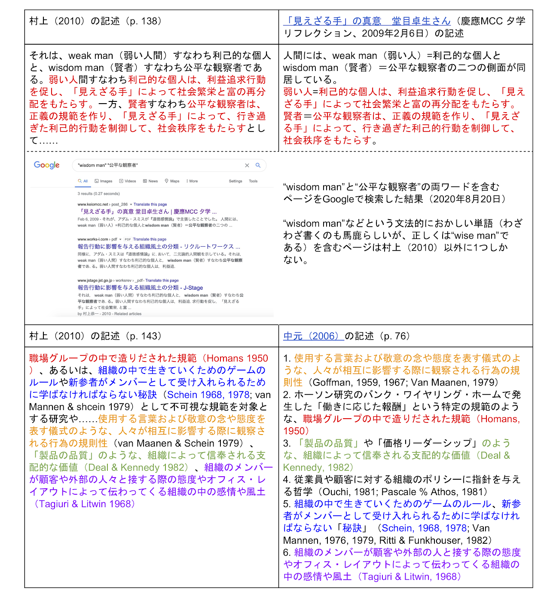

# 村上恭一「報告行動に影響を与える組織風土の分類」で見つけた剽窃

[村上恭一「報告行動に影響を与える組織風土の分類」（『Works Review』Vol. 5、2010年）](https://doi.org/10.34391/worksrev.5.11_1){:target="_blank"}を読んでいて、怪しい箇所がいくつかあったので軽く検索してみたところ、文法の間違いまで丸写しの見事な剽窃が見つかったので書き留めておく次第です。アダム・スミスのwise manをwisdom manと書いていることのおかしさに気づかず通してしまう人間が編集部を務めている雑誌を信用する人はあまりいないとは思いますが、文献収集に不慣れな大学生が安易にコピペしたりすると悲惨なことになるので、注意喚起しておく価値もなくはないでしょう。

具体的に述べると（下表も参照のこと）、まずp. 138の「利己的な個人は、利益追求行動を促し…」というくだりは[慶應MCC 夕学リフレクションなるブログに投稿された記事](http://www.keiomcc.net/sekigaku-blog/2009/02/post_286.html){:target="_blank"}のコピペ（いちおう[スクリーンショット](murakami2010plagiarism/murakami2010ss.png){:target="_blank"}も保存）。学生のレポートを採点したことがある人ならば、"wisdom man"という信じられない文法ミスを見れば即座にコピペを疑うわけで、検索してみたら見事に村上（2010）以外には1件しかヒットしませんでした。

この時点で大学生のレポートでも0点ですが、さらにp. 143で組織文化について述べているところは、順番をちょっと変えているだけで、[中元麻衣子「経営理念とは何か：バリュー・マネジメントの理解のために」（『広島大学マネジメント研究』6号、2006年）](http://doi.org/10.15027/19977){:target="_blank"}のコピペ。どこがどこのコピペになっているのか分かるよう、下図に色分けして示しておきました。これまた学生のレポートを採点したことがある人ならば、上記の信じられない文法ミスを見逃すような語学力の人間がこんなに細かく外国語文献を参照しているのを見れば即座にコピペを疑うわけで…（以下略）。

